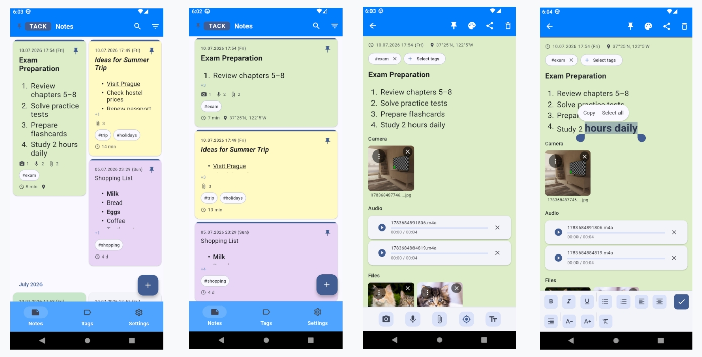
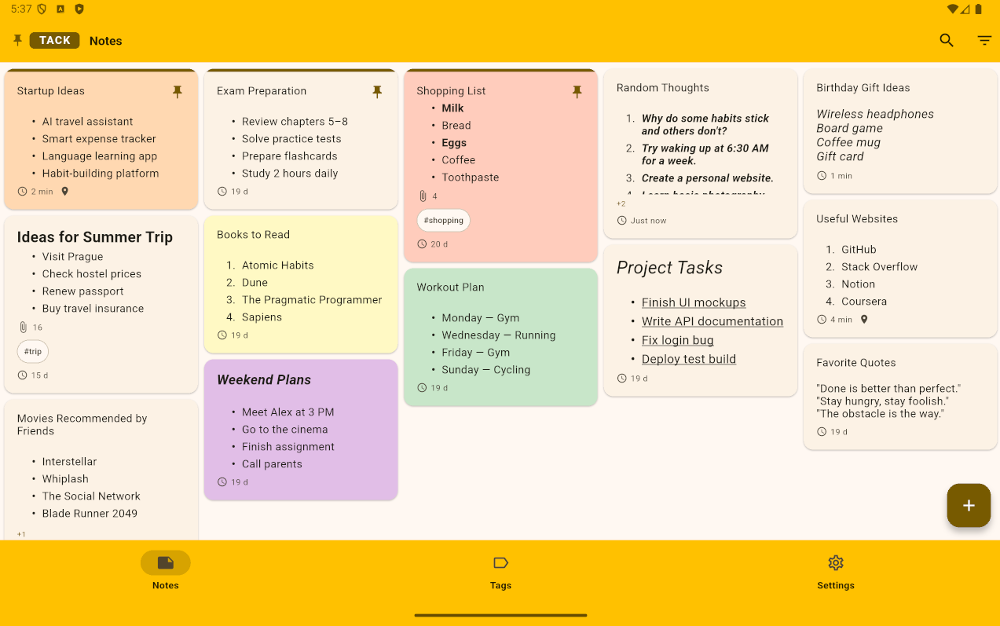
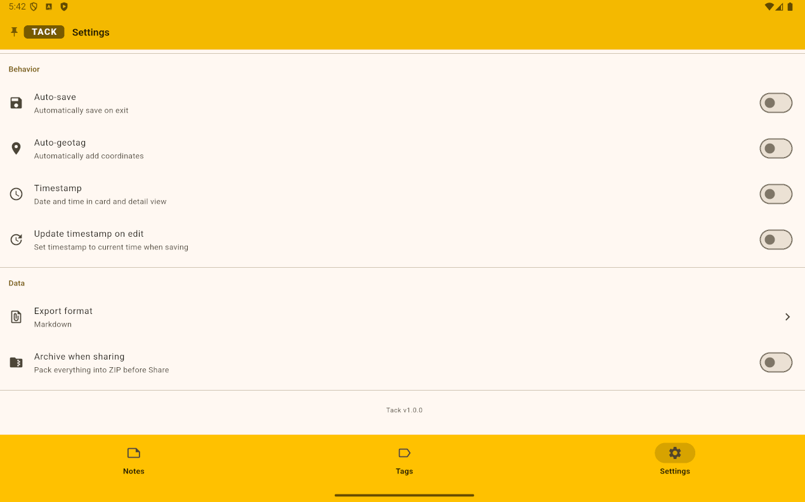
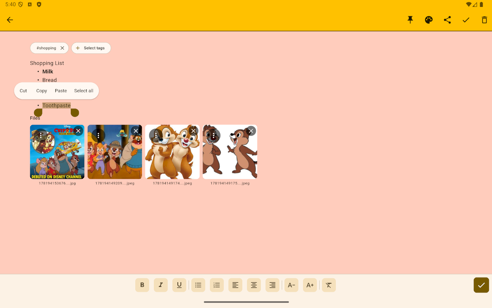

# Tack 

**Tack** *(читается как "Тэк")* — локальное приложение для создания и управления заметками с поддержкой мультимедиа, геотегов и экспорта. Приложение разработано с целью изучения современных технологий vibe-кодинга в мобильной разработке.


## Функционал

- **Заметки** — создание, редактирование, удаление; автосохранение; групповая обработка; пустые заметки отбрасываются
- **Теги** — гибкая система тегов с поиском, созданием и управлением
- **Форматирование заметок** — встроенные инструменты форматирования текста заметок 
- **Мультимедиа** — фото, видео- и аудиозапись, прикрепление файлов
- **Геолокация** — ручная и автоматическая (настраиваемый авто-геоштамп)
- **Просмотр миниатюр** — тап для увеличенного превью фото и файлов
- **Поиск** — полнотекстовый и по тегам, с фильтрацией по датам
- **Экспорт** — Markdown и JSON, с архивацией в ZIP
- **Настройки** — тема оформления (7 схем), размер шрифта, группировка, сортировка, язык (13 языков)
- **Целевая платформа** — планшеты и смартфоны 

## Технологии

- **Flutter** — кроссплатформенный UI
- **Riverpod** — управление состоянием
- **SharedPreferences** — хранение настроек
- **SQLite** — база данных заметок
- **Geolocator** — геолокация
- **record** / **audioplayers** — запись и воспроизведение аудио
- **ImagePicker** / **FilePicker** — выбор медиа
- **l10n** — интернационализация (13 языков)

## Установка

### Требования
- Flutter SDK >= 3.16
- Dart >= 3.2

### Запуск и сборка

```bash
git clone https://github.com/idalgo-2021/tack
cd tack
flutter pub get
dart run build_runner build
flutter gen-l10n
flutter run
```

#### Варианты сборки APK

| Команда | Когда использовать | Размер | Примечание |
|----------|-------------------|---------|------------|
| `flutter build apk --release` | Обычная сборка | Обычный | Самый популярный вариант |
| `flutter build apk --release --split-per-abi` | Для уменьшения размера | Маленький | Создаст 3 APK-файла (`armeabi-v7a`, `arm64-v8a`, `x86_64`) |
| `flutter build appbundle --release` | Для публикации в Google Play | — | Создаёт `.aab` файл (не для прямой установки) |

Готовый файл находиться здесь: *build/app/outputs/flutter-apk/*


## Ограничения текущей версии 

* Отсутствует шифрование данных (т.е. заметки, вложения и геоданные хранятся в открытом виде)
* При экспорте/шаринге заметки и прикреплённые файлы передаются как есть, без шифрования
* Временные экспортные файлы очищаются "best effort" (при сбое очистки файлы могут остаться в temp)
* Отсутствует явная валидация результата открытия/шаринга файлов(нет проверки существования файла, успешности его открытия, обработки ошибок)
* Геолокация работает только при наличии разрешения и включённой геолокации на устройстве
* Тестовое покрытие практически отсутствует
* Приложение тестировалась на эмуляторе(10"планшет Android 16.0 API 36.0, 6.4"смартфон Android 13.0 API 33.0) и одном смартфоне с Android 10.0. На устройствах Apple(iOS) не тестировалось


<details>
<summary>Идеи / TODO лист:</summary>

* Устранить ограничения представленные выше(особенно шифрование и тестовое покрытие)
* Улучшить UI(в частности механики редактирования текста заметок)
* Механика рисования скетчей пальцем/стилусом
* ОТправка заметок на рабочий стол
* Функцию перемещения заметок\файлов в разные каталоги устройства
* Отображение населенного пункта по геотегам
* Ограничения на число тегов, на размеры и типы прикрепляемых файлов
* Контроль дублей прикрепляемых к заметке файлов
* Механики контроля\удаления файлов "сирот"
* Техдолг и перфоманс

</details>
<br><br>


## Снимки экрана

### Смартфон




### Планшет






